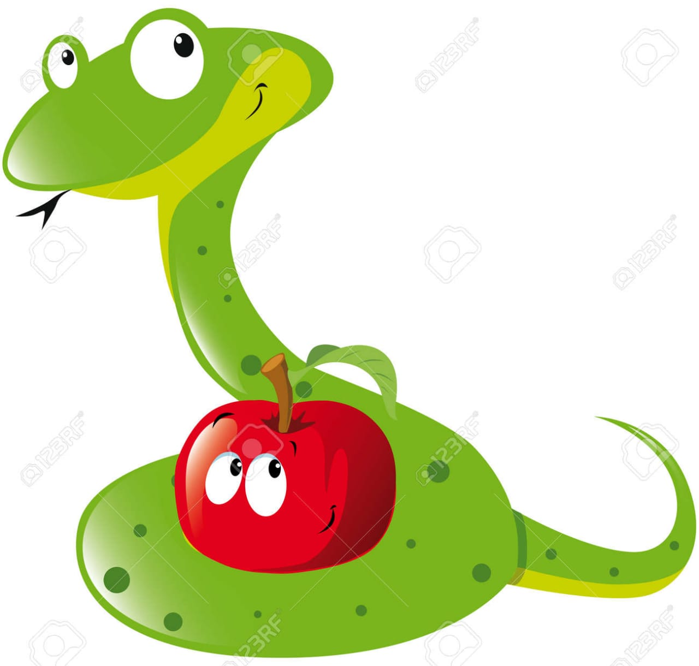

# fast-Devourer
# 

## *Fast-Devourer is a game developed using Python with the Pygame framework.*

## **Pygame is a Pyhton framework which makes it easy to create programes with the 2D graghics and it works the same way in every operating system.**

# How to Play Fast-Devourer

### ***Fast-Devourer is a Nibbles clone. The player starts out controlling a short worm that is constantlymoving around the screen. The player cannot stop or slow down the worm, but they can control which direction it turns. A red apple appears randomly on the screen, and the player must move the worm so that it eats the apple. Each time the worm eats an apple, the worm grows longer by one segment and a new apply randomly appears on the screen. The game is over if the wormcrashes into itself or the edges of the screen.***

### ***IM SO HUNGRY***

https://user-images.githubusercontent.com/115734375/214470735-41d870a8-957c-4bbd-8ec1-d17a1e4b6b3c.mp4

## **Installation**
 Clone the repository and open it in any code editor. 
